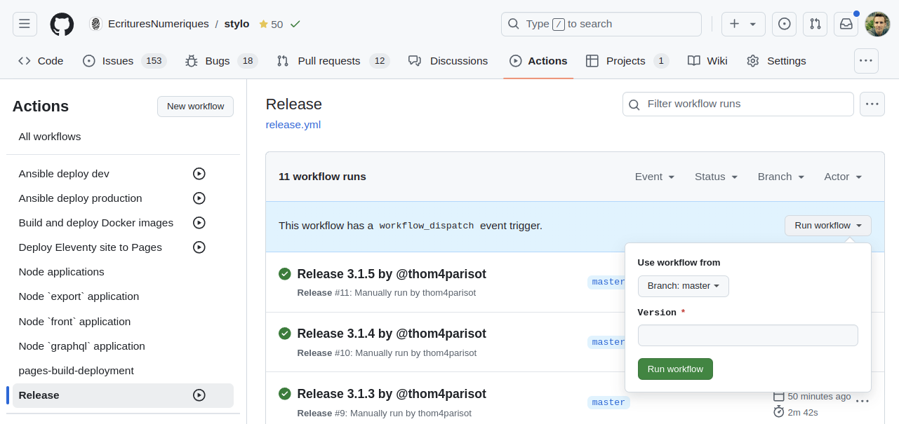
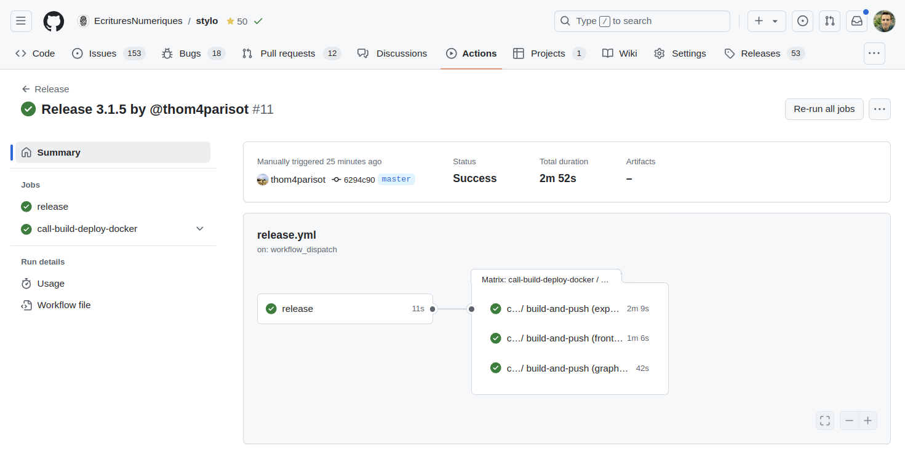
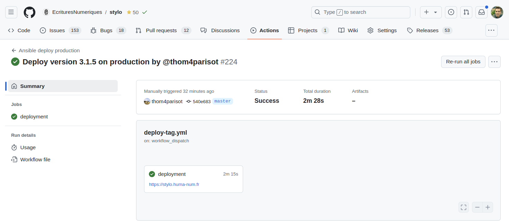

# Release

Cette page explique comment créer une nouvelle release de Stylo et comment la déployer sur https://stylo.huma-num.fr/.
Pour rappel, l'ensemble des changements qui arrivent sur la branche principale (i.e., `master`) sont déployés automatiquement sur https://stylo-dev.huma-num.fr/.

# Pré-requis

- Avoir un compte GitHub
- Avoir les droits d'écriture sur le projet GitHub [EcrituresNumeriques/stylo](https://github.com/EcrituresNumeriques/stylo)
- Avoir les droits de lancer le workflow [release](https://github.com/EcrituresNumeriques/stylo/actions/workflows/release.yml)

## Créer une nouvelle release

- Aller sur la page https://github.com/EcrituresNumeriques/stylo/actions/workflows/release.yml et cliquer sur le bouton "Run workflow".
- Une fenêtre s'ouvre et propose de renseigner une branche ainsi qu'un numéro de version :
  

- Laisser la branche principale (i.e., `master`) sélectionnée et renseigner une version (sans suffixe).
  Par exemple : `3.4.5`.
- Cliquer sur le bouton vert "Run workflow"

Une nouvelle ligne va s'afficher dans la liste. Vous pouvez voir le détail en cliquant sur la ligne : 

Le workflow se compose de deux étapes principales : 
- release 
  - modifie la version dans les fichiers `package.json` (`package-lock.json`)
  - commit les changements
  - crée un tag à partir de la version renseignée lors du lancement du workflow
- call-build-deploy-docker
  - construit et déploie les images Docker sur le registre ghcr.io
    - https://github.com/EcrituresNumeriques/stylo/pkgs/container/stylo-graphql
    - https://github.com/EcrituresNumeriques/stylo/pkgs/container/stylo-front
    - https://github.com/EcrituresNumeriques/stylo/pkgs/container/stylo-export

> [!NOTE]
> À noter que cette deuxième étape peut être lancée manuellement puisqu'elle repose sur le workflow [docker](https://github.com/EcrituresNumeriques/stylo/actions/workflows/docker.yml).

Une fois ce workflow terminé, vous devriez avoir une nouvelle version des images Docker dans le registre ghcr.io.

## Déployer une version en production

Le déploiement en production nécessite une action manuelle.

> [!NOTE]
> Si vous souhaitez déployer une nouvelle release, assurez-vous que la nouvelle version des images Docker `stylo-graphql`, `stylo-front` et `stylo-export` disponibles sur le registre ghcr.io.

Une fois la version des images disponibles sur ghcr.io, vous pouvez lancer le workflow [deploy](https://github.com/EcrituresNumeriques/stylo/actions/workflows/deploy-tag.yml).
De la même façon que pour le workflow de release, cliquer sur le bouton "Run workflow".  
Laisser la branche principale (i.e., `master`) sélectionnée et renseigner la version à déployer (sans suffixe). Par exemple : `3.4.5`.  

Une nouvelle ligne va s'afficher dans la liste. Vous pouvez voir le détail en cliquant sur la ligne : 

Une fois le déploiement terminé en succès, vous pouvez vous rendre sur https://stylo.huma-num.fr/ afin de vérifier que la version est bien déployée.
Le numéro de version s'affiche dans le pied de page :

Ici, la version déployée est la version 3.1.5.
