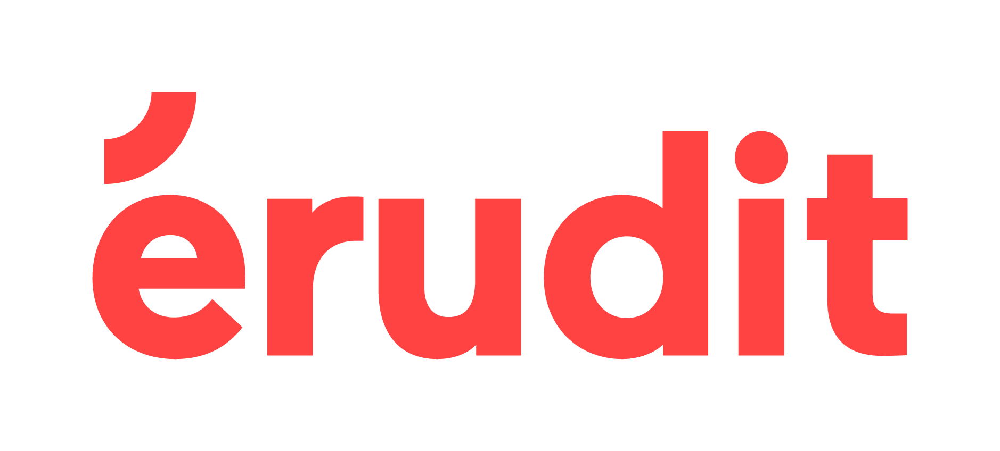

# About ***_Stylo_***

---

Stylo is developed by the [Canada Research Chair in Digital Textualities](https://ecrituresnumeriques.ca/en/) and [PiNinja](https://3.14159.ninja/) company, with the support of [Érudit](https://www.erudit.org/en/), under [GPL-3.0](https://github.com/EcrituresNumeriques/stylo/blob/master/LICENSE) licence.

## The project

Stylo is currently a prototype tool undergoing development, implemented in the respective editorial chains of the journal [Sens Public](http://sens-public.org)and the publishing house [Les ateliers](https://ateliers.sens-public.org). It is currently in the testing phase for other journals, in particular for the partnership project, [Revue2.0](http://revue20.org/). This tool is also used by various authors and students for their personal scientific and institutional work.

Stylo can be used online through the address [stylo.huma-num.fr](https://stylo.huma-num.fr/). This version of Stylo is deployed and maintained by [Huma-Num](https://www.huma-num.fr/), who provides data backup and security.

Stylo\'s source code is available [on Github](https://github.com/EcrituresNumeriques/stylo/).

## Roadmap

- Improvement of the general ergonomics and graphics
- WYSIWYM text editor features and keyboard shortcuts
- Semantic enrichment
- Development of connectors for off-line publishers
- Collaborative writing through simultaneous changes
- English resource information

## *Stylo*-sophy

Stylo, a WYSIWYM text editor for Human Sciences, is designed to change the entire digital editorial chain of scholarly journals in the Human and Social Sciences.

Despite being essential for digital dissemination, structuring documents and their markup are steps usually postponed until the end of the editorial chain, when in reality they should be considered from the beginning of process (by the author and from the first revision of articles). In this sense, it seems urgent and consistent to reintegrate the markup work and text structuring from the beginning of the editorial chain.

Stylo's philosophy is based around putting the management of markup in the hands of researchers by addressing their competencies; researchers possess more semantically oriented skills, rather than graphic knowledge.

Editing is based on the separation between semantic markup and graphic display, which allows the author to focus on the meaning of the text rather than its formatting.

Stylo offers a free solution that is based on standards (markdown, yaml, BibTex) allowing:

- Production of well-marked text with rich metadata and a structured bibliography
- Production of multiple outputs (PDF, HTML, XML, ODT...) from just one document

Stylo is a tool that implements formats and existing conversion technologies. These technologies are already used in the community, which enables free circulation of documents that are not enclosed in a particular format.

## Contributors

The researchers participating in the project are as follows:
- [Arthur Juchereau](https://ecrituresnumeriques.ca/en/Team/Arthur-Juchereau)
- [Marcello Vitali-Rosati](https://ecrituresnumeriques.ca/en/Team/Marcello-Vitali-Rosati)
- [Servanne Monjour](https://ecrituresnumeriques.ca/en/Team/Servanne-Monjour)
- [Nicolas Sauret](https://ecrituresnumeriques.ca/en/Team/Nicolas-Sauret)
- [Margot Mellet](https://ecrituresnumeriques.ca/en/Team/Margot-Mellet)
- [Lena Krause](https://ecrituresnumeriques.ca/en/Team/Lena-Krause)
