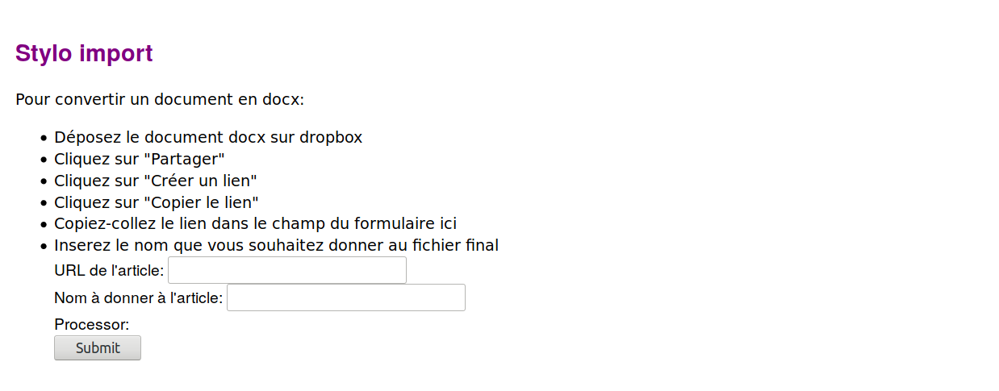
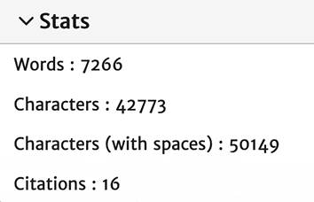

# First steps with Stylo

---

## Creating an account
To use Stylo, creating a user account is necessary. To create an account, please click [here](https://stylo.huma-num.fr/register) and fill in the mandatory fields


If you already have an account, sign-in [here](https://stylo.huma-num.fr).

## User page
The home page for your Stylo account lists your personal articles as well as those that have been shared with you by other Stylo users.

By default, a first article, called "How to Stylo", appears on the platform, and it details each step involved with writing an article. Do not hesitate to refer to this page if you would like to write your article directly in Stylo, or if you have questions on the articles that require special treatment (illustrations, etc.).

For each article, many actions are possible:

|Button|Function|
|:-:|:--|
|  | To open the article and edit|
|  | To share the article and its version history with another Stylo user. It will be called: "[Copy]New article"|
|  | To duplicate only the last version of the article|
|  | To rename the article|
|  | To expand other functions relating to the article|
||  | To consult the history of saved versions|
||  | To fill in the article tags by clicking on \"edit\"|
||  | To delete the article|

Note: The document name, as it is visible in Stylo, does not correspond to the title of the article that will be generated.

**Careful :** Deleting an article is irreversible. If the article is shared with another user, it will remain available for this user even after it is deleted.

## Understand the article structure

An article in Stylo is made up of the following three separate elements:

  - The text body
  - Metadate
  - A bibliography

Stylo offers an integrated interface to edit each of these elements, whose sources are accessible at any time via [the export module](premierspas.md#Export).

## Editing interface
The article editing interface offers many modules:

  - A text body: a space to edit the body of the article's text.
  - A metadata manager: a space to edit information concerning the article (summary, author, key words, publication date, etc.).
  - A version manager: a space that saves and renames minor and major versions (*Save Minor* and *Save Major*), that accesses successive versions to consult, export and compare them with other versions.
  - A bibliography manager: a space to edit references (cited and not cited in the text body).
  - A content table: automatically presenting a summary of the article, based on the titles within the text body).
  - A statistic tool: presenting statistical information on the article (word and character count, etc.).


## Share option

The **[Share]** function allows you to invite co-authors to work on the same article. These users then have access to the entire history. The article versions will synchronise for all the users as changes are made to the document.

**Careful** : Sharing an article with another user is possible only by entering the email address that the other user entered to create their Stylo account.

## New article

Click on the "Create a new article" button (you must enter the title of the article in the appropriate field, then click again on the "Create" button).

To create a new article, you must click on the button:


You must then enter the name of the document in the field provided for this purpose


and validate the operation by once again clicking on the button


During this process, you can also add tags to the article by clicking on the button


The article will then appear in your list of articles. Click on the button


to access the editing space and begin to work on your article.

## Import

If the content that you intended to edit is already structured in another format, in another space, it is possible to transfer it into the Stylo editing space. Stylo essentially edits Markdown language (extension .md): to import content currently in DOC format (extension .doc) or DOCX (extension .docx), we have put in place an [online converter](https://stylo-export.ecrituresnumeriques.ca/importdocx.html), which allows you to convert a docx document to md. The procedure is detailed in the conversion page.



Once you have converted, an md. document is generated: open it with a text editor (Atom, GeDit), and copy/paste the document content into the space of your Stylo article.

## Editing

The editing environment is made up of 5 modules:

- In the center: the writing space devoted to the body of the article
- To the right: the **[Metadata]** button opens the metadata editor 
- To the left:
  - History of document versions to navigate and interact with different saved versions
  - The *Table of contents* lists the titles at 2^nd^, 3^rd^, 4^th^, etc. levels
  - The *Bibliography* lists the bibliographic references
  - The *Stats* offer some quantitative data for the article

## Writing in Markdown

The Stylo article must be writing in Markdown language, an easy to learn markup language.

Markdown language allows a syntax structure that is easy to both read and write. Here are the main writing rules for Markdown:

- Title: the levels of the title (level 1 for the title of the article, level 2 for the titles of the section, etc.) are organised using ```#```, like this: 
	- ```# Title of the article```, ```## Introduction```, etc.

Careful: the body of the article text does not support titles for level 1; titles for level 1 are only used for the *Title* fields in the metadata.

- Italics: italics can be created in two ways: ```_word_``` or ```*word*``` 
- Bold: bold can be created like this: ```**word**```
- Long citation: long citations are created like this: ```> long citation```
- Footnote: a footnote can be created with or without a number:
	- with a number :

```
Here is my text[^1]

[^1]:A footnote with a number and reference
```

- Without a number :

```
Here is my text^[inline footnote.]
```

To improve your knowledge in Markdown syntax, you can see this [page](http://stylo-doc.ecrituresnumeriques.ca/fr_FR/#!pages/syntaxemarkdown.md).

## Versions


A document version corresponds to saving your work. A version always contains the following article elements: metadata, bibliography, text body. Therefore, in changing the old version, each of these three elements are updated.

Your work is automatically saved by Stylo. However, you can -- and we do advise this -- use the saving functions to **[Save Minor]** or **[Save Major]** versions by naming each. A minor version corresponds to minor changes, whereas a major version creates a version with the most important changes.

This way, when you have created a version that you are satisfied with, you can make a title of your version in the field *Version label* before saving it as a minor or major version.

At all times, you can view your work. That is, you can view both the current version that you are in the process of working on and the preceding version, by clicking on the **[preview]** button:


Each version contains many functions:

- For the editable version (*Edition*):

|Button|Function|
|:-:|:--|
|  | To save a major version of your work |
|  | To save a minor version of your work |
|  | To export and save the version in different formats |
|  | To access the preview of your work and annotate it |

- For a previous version :
	- **[Compare]** to compare different versions (a previous version and the current version or two previous versions). For more information of the **[Compare]** function, you can consult this [page](http://stylo-doc.ecrituresnumeriques.ca/fr_FR/#!pages/interface.md)
	-  : to export and download the document in different formats: HTML5, XML érudit, etc.
	- **[preview]** to access a preview of your work and to annotate it. For more information on the **[preview]** function, you can see this [page](http://stylo-doc.ecrituresnumeriques.ca/fr_FR/#!pages/preview.md)

To view a previous version, you must click on its title. To return to the editable version, you must click on the **[Edit]** button.

## Export
The export module offers many formats (HTML5, XML, PDF, etc.), allowing you to choose a bibliographic style, and the inclusion or not of a content table.

For more information on Stylo exporting, you can see this [page](http://stylo-doc.ecrituresnumeriques.ca/fr_FR/#!pages/export.md)

## Summary


The summary appears in a list of titles at levels 1, 2, and so on. These titles are clickable, for quick access to that part of the corresponding text.

## Bibliography

The bibliography lists the bibliographic references that you have added. The bibliographic references can be added either one by one, or grouped. To add your reference, you must click on **[Manage Bibliography]** in the
left pane: the *Bibliography* tool then opens and offers you a number of possibilities:

1. **Zotero** : you can synchronise your bibliography using a Zotero folder (the folder must be public) by entering the folder URL.
2. **Citations** : you can manually fill in your bibliography using BibTex format.
3. **Raw bibtex** : to edit the bibtex

You can directly [structure your references in BibTex](http://www.andy-roberts.net/writing/latex/bibliographies), or export your references in BibTex thanks to your bibliography management tools:

- See tutorials : <a class="btn btn-info" href="http://sens-public.org/IMG/pdf/Utiliser_Zotero.pdf" role="button">Zotero</a> <a class="btn btn-info" href="https://libguides.usask.ca/c.php?g=218034&p=1446316" role="button">Mendeley</a>

To add a reference to the article, you just need to click on the reference, then paste (Ctrl+V) the reference in the desired place of the text. This way, a click is the same as "copying" the reference key to the clipboard. Then, you just need to paste it into the text body.


For more information on managing the bibliography, you can see this [page](http://stylo-doc.ecrituresnumeriques.ca/fr_FR/#!pages/bibliographie.md)

## Metadata


The [Metadata] button allows you to open the metadata pane. Three editing modes are available:

1. **Basic Mode** : allows editing the basic metadata: Title, subtitle, summaries, authors and keywords.
2. **Editor Mode** : allows editing all metadata relating to a scholarly journal: identifying an article, folder information, evaluation information, journal categories, journal keywords, etc.
2. **Raw Mode** : an editing space for an advanced user, where you can modify fields directly in yaml structure.

**Important :** in order to export an article, these fields must be filled in:

- A title
- An author name

For more information on metadata editing, you can see this [page](http://stylo-doc.ecrituresnumeriques.ca/fr_FR/#!pages/bibliographie.md)

**Careful**: in the metadata pane is the "Bibliography" division, including the *Display* option, which allows you to choose to view the bibliography either in its entirety ("All citations"), or just the references which have been cited in the body of the article ("Only used"). 


## Statistics



The *Stats* menu provides information on:

- The number of words
- The number of characters, without spaces
- The number of characters, with spaces
- The number of citations

## Annotation

There are two annotation possibilities:

1. Annotate a version
2. Annotate the article

To annotate a version, click on the version number you want to annotate and then click **[preview]**. A preview of the article in HTML will open with the annotation tool *Hypothes.is* on the right.


**Important**: If you annotate a version, your annotation will not be visible on the other version.

To annotate the article, click **[Edit]** and then **[Preview]** The annotations will relate to the article. However, given that the editable version is subject to changes, annotations can no longer be anchored in the correct parts of the text (which could have been deleted or moved).
