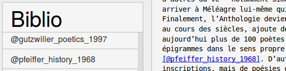

# Managing references

Bibliographic references are managed in BibTex format. In the left panel, select **[Bibliography]** then **[Manage Bibliography]**. The *Bibliography* tool opens and offers you several possibilities:

1. **Zotero**: you can synchronize your bibliography from a Zotero folder (folder that must be public) by entering the folder's url.
2. **Citations** : it is possible for you to fill in your bibliography manually in bibtex format.
3. **Raw bibtex** : to edit bibtex

You can directly [structure your references in bibtex](http://www.andy-roberts.net/writing/latex/bibliographies), or export your references in bibtex thanks to your bibliography management tool :

- see tutorials : <a class="btn btn-info" href="http://archive.sens-public.org/IMG/pdf/Utiliser_Zotero.pdf" role="button">Zotero</a> <a class="btn btn-info" href="https://libguides.usask.ca/c.php?g=218034&p=1446316" role="button">Mendeley</a>

## Synchronize a Zotero collection

It is possible to synchronize the references of an article with a sub-folder (a collection) of a public Zotero group, by entering the identifier of the sub-folder:

1. in the left panel select "Bibliography" then "Manage Bibliography".
2. Follow the instructions for importing your bibliography from Zotero: enter the group ID followed by "collections" and then the sub-collection ID. Example: `322999/collections/5MJ6MP6P`.
3. Click on "Save zotero link and fetch".
4. Your bibliographic references should appear in the left panel under "Bibliography".

Some common mistakes to avoid: your group must be public, the group ID and the sub-collection ID are separated by `/collections/`.

## Insert a bibliographic reference

To add a reference to the article, simply click on the reference, then paste (Ctrl+V) the reference into the text at the desired location. It will then appear as `[shirky_here_2008]`. To understand, one click is equivalent to "copying" the bibtex key of the reference in the clipboard 

Inserting a bibtex key in the body text has two effects:

1. The key is automatically replaced by the correct formatted quote call in the body text, for example : (Shirky 2008).
2. The complete bibliographic reference is automatically added at the end of the document.

## General scenarios

The Markdown syntax allows you to finely structure your bibliographical references. Depending on your needs, here are different cases to produce the citation call:
- `[@shirky_here_2008]` will produce : (Shirky 2008)
- `[@shirky_here_2008, p194]` will produce : (Shirky 2008, p194)
- `@shirky_here_2008` will produce: Shirky (2008)
- `[-@shirky_here_2008]` will produce : (2008)

For example :

- If you want to quote the author + the year and the page in brackets :

| In the editor | In the preview|
|:--|:--|
|`Real space, the space of our material life, ` `and cyberspace (which is certainly ` `not so completely virtual) should not be ` `called separately, since they ` `interpenetrate each other more ` `firmly [@shirky_here_2008, p. 194]. `|` Real space, the space of our material life,` ` and cyberspace (which is certainly ` `not so completely virtual) should not be ` `called separately, since they ` `interpenetrate each other more ` `firmly (Shirky 2008, 194).`|

- If the author's name already appears, and you just want to add the year of publication in brackets :

|In the publisher | In the preview|
|:--|:--|
|`Clay @shirky_here_2008 [p. 194] suggested that real space` `, that of our material life, and ` `cyberspace (which is certainly not so completely ` `virtual) should not be called ` `separate since they interpenetrate ` ` more and more firmly. Clay Shirky (2008, 194), suggested that real space, the space of our material life, and cyberspace (which is certainly not so completely virtual) should not be called separately since they are increasingly firmly interpenetrating.`|

- To avoid repetition of a name, and to indicate only the year, put a `-' in front of the key.

|In the editor | In the preview|
|:--|:--|
|`Conceptual artists had tried to circumvent` ` the rules of the art market (apparently` ` without much success or` ` without much conviction, if` ` we are to believe Lucy Lippard [-@lippard_six_1973; -@lippard_get_1984])` ` to circumvent the rules of the art market. ` `Conceptual artists had tried to circumvent` ` the rules of the art market` ` (apparently without much success or` ` without much conviction according to Lucy Lippard (1973; 1984)).`|

## Some resources

- [What is Zotero?](http://editorialisation.org/ediwiki/index.php?title=Zotero)
- [How to install and use Zotero?](https://bib.umontreal.ca/citer/logiciels-bibliographiques/zotero/installer)
- [How to quickly import a bibliography to Zotero?](https://bib.umontreal.ca/citer/logiciels-bibliographiques/zotero/installer#h5o-13)
