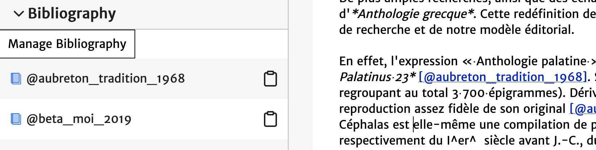

# Gestion de références

La bibliographie liste les références bibliographiques que vous avez ajoutées. Les références bibliographiques peuvent être ajoutées une par une, ou groupées. Pour ajouter vos références, vous devez cliquer sur **[Manage Bibliography]** dans le volet de gauche : l'outil *Bibliographie* s'ouvre alors et vous propose plusieurs possibilités :

1. **Zotero** : il vous est possible de synchroniser votre bibliographie à partir d'un dossier Zotero (dossier qui doit être public) en entrant l'url du dossier.
2. **Citations** : il vous est possible de renseigner votre bibliographie manuellement sous format bibtex.
3. **Raw bibtex** : pour éditer le bibtex

Vous pouvez directement [structurer vos références en bibtex](http://www.andy-roberts.net/writing/latex/bibliographies), ou exporter vos références en bibtex grâce à votre outil de gestion de bibliographie :

- voir tutoriels : <a class="btn btn-info" href="http://archive.sens-public.org/IMG/pdf/Utiliser_Zotero.pdf" role="button">Zotero</a> <a class="btn btn-info" href="https://libguides.usask.ca/c.php?g=218034&p=1446316" role="button">Mendeley</a>

## Synchroniser une collection Zotero

Il est possible de synchroniser les références d'un article avec un sous-dossier (une collection) d'un groupe Zotero public, en renseignant l'identifiant du sous-dossier :

1. dans le panneau de gauche sélectionnez "Bibliography" puis "Manage Bibliography"
2. suivez les indications pour importer votre bibliographie depuis Zotero : indiquez l'identifiant du groupe suivi de `collections` puis de l'identifiant de la sous-collection. Exemple : `322999/collections/5MJ6MP6P`
3. cliquez sur "Save zotero link and fetch"
4. vos références bibliographiques devraient apparaître dans le panneau de gauche sous "Bibliography"

Quelques erreurs fréquentes à éviter : votre groupe doit être public, l'identifiant du groupe et l'identifiant de la sous-collection sont séparés par `/collections/`.

## Insérer une référence bibliographique

Pour ajouter une référence à l'article, il suffit de cliquer sur la référence, puis de coller (Ctrl+V) la référence dans le texte à l'endroit souhaité. Elle apparaitra alors ainsi `[shirky_here_2008]`. Pour bien comprendre, un clic revient à "copier" la clé bibtex de la référence dans le presse-papier.

Insérer une clé bibtex dans le corps de texte a deux effets :

1. La clé est remplacée automatiquement par l'appel de citation au bon format dans le corps de texte, par exemple : (Shirky 2008).
2. La référence bibliographique complète est ajoutée automatiquement en fin de document.

## Cas généraux

La syntaxe Markdown permet de structurer finement vos références bibliographiques. En fonction des besoins, voici différents cas de figure pour produire l'appel de citation :
- `[@shirky_here_2008]` produira l'appel de citation suivant : (Shirky 2008)
- `[@shirky_here_2008, p194]` produira l'appel de citation suivant : (Shirky 2008, p194)
- `@shirky_here_2008` produira l'appel de citation suivant : Shirky (2008)
- `[-@shirky_here_2008]` produira l'appel de citation suivant : (2008)

Par exemple :

1. Si vous souhaitez citer l'auteur + l'année et la page entre parenthèses :

|Affichage dans Atom | Affichage définitif|
|:--|:--|
|`L’espace réel, celui de notre vie matérielle,` `et le cyberespace (qui n’est certes` `pas si complètement virtuel) ne devraient` `pas faire l’objet d’appellations séparées` `puisqu’ils s’interpénètrent de plus` `en plus fermement [@shirky_here_2008, p. 194].` | `L’espace réel, celui de notre vie matérielle,` `et le cyberespace (qui n’est certes` ` pas si complètement virtuel) ne devraient` `pas faire l’objet d’appellations séparées` `puisqu’ils s’interpénètrent de plus` `en plus fermement (Shirky 2008, 194).`|

2. Si le nom de l'auteur apparaît déjà, et que vous souhaitez simplement ajouter l'année de publication entre parenthèses :

|Affichage dans Atom | Affichage définitif|
|:--|:--|
|`Clay @shirky_here_2008[p. 194] a suggéré que l’espace réel` `, celui de notre vie matérielle, et` `le cyberespace (qui n’est certes pas si complètement` `virtuel) ne devraient pas faire l’objet` `d’appellations séparées puisqu’ils s’interpénètrent ` `de plus en plus fermement.` | `Clay Shirky (2008, 194), a suggéré que l’espace réel` `, celui de notre vie matérielle, et` `le cyberespace (qui n’est certes pas si complètement` `virtuel) ne devraient pas faire l’objet` `d’appellations séparées puisqu’ils s’interpénètrent` `de plus en plus fermement.`|

3. Afin d'éviter la répétition d'un nom, et indiquer seulement l'année, faire figurer un `-` devant la clé.

|Affichage dans Atom | Affichage définitif|
|:--|:--|
|`Des artistes conceptuels avaient cherché` `(apparemment sans grand succès ou` `sans grande conviction si l’on` `en croit Lucy Lippard [-@lippard_six_1973 ; -@lippard_get_1984])` `à contourner les règles du marché de l’art.` | `Des artistes conceptuels avaient cherché` `(apparemment sans grand succès ou` `sans grande conviction si l’on en croit Lucy Lippard (1973 ; 1984))` `à contourner les règles du marché de l’art.`|

## Quelques ressources

- [Qu'est-ce que Zotero ?](http://editorialisation.org/ediwiki/index.php?title=Zotero)
- [Comment installer et utiliser Zotero ?](https://bib.umontreal.ca/citer/logiciels-bibliographiques/zotero/installer)
- [Comment importer rapidement une bibliographie vers Zotero ?](https://bib.umontreal.ca/citer/logiciels-bibliographiques/zotero/installer#h5o-13)
