# Gérer les articles

Vos articles sont disponibles dans la page _Articles_ cliquable via la barre latérale de votre compte Stylo :

En haut de cette page, vous sont proposées plusieurs fonctionnalités :

- la création d'un nouvel article;
- l'éditon et la gestion des tags;
- la recherche d'un article.

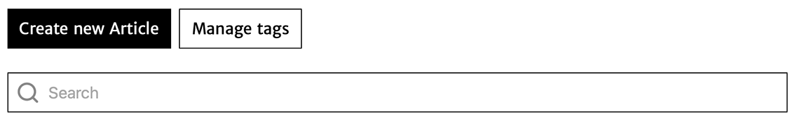

## Créer un nouvel article

Cliquez sur le bouton “Create new article” (vous devrez renseigner le titre de l’article dans la case prévue à cet effet, puis cliquer à nouveau sur le bouton “Create this article”).

Pour créer un nouvel article, il suffit de cliquer sur le bouton :

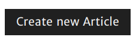.

Vous devez ensuite renseigner le nom du document dans le champ prévu à cet effet

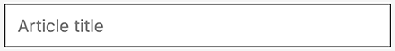

et valider l'opération en cliquant sur le bouton

.

Lors de cette opération, il vous est également possible d'ajouter des tags à l'article en cliquant sur le bouton

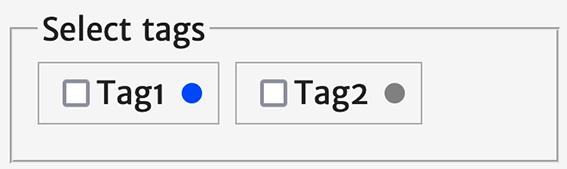

**Attention** : vous ne pouvez ajouter que des tags déjà édités dans votre compte Stylo.

L’article apparaît désormais dans votre liste d’articles.

## Éditer et gérer les tags

Pour créer et éditer vos tags, cliquez sur "Manage tags". Un volet de gauche apparaît alors :

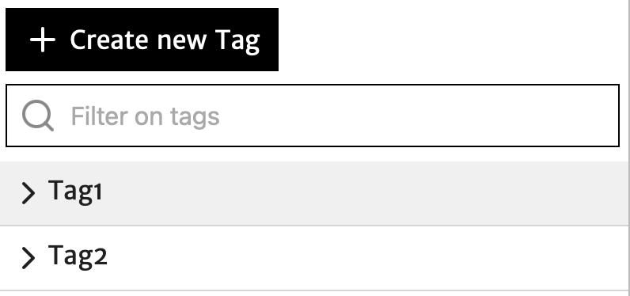

En cliquant sur le nom du tag, il vous est possible de sélectionner dans votre liste d'articles seulement les articles concernés par le tag en question.

Vous pouvez visualiser les détails du tag en cliquant sur le chevron situé à côté du nom du tag :

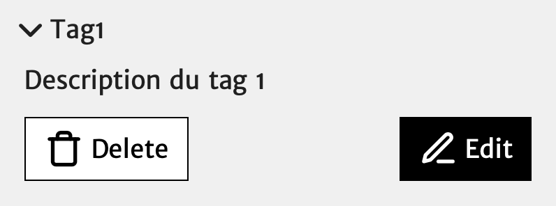

Vous avez alors accès au descriptif du tag en lecture, mais également à plusieurs fonctionnalités :

|Bouton|Fonction|
|:-:|:--|
| 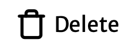 | pour supprimer le tag |
|  | pour ouvrir le tag en édition |

Le mode édition du tag se présente ainsi :

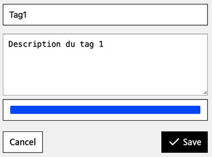

Cet espace vous permet de :

- modifier le nom du tag;
- modifier le descriptif du tag;
- choisir une couleur pour le tag.

N'oubliez pas d'enregistrer vos modifications une fois votre édition du tag terminée.

## Effectuer une recherche dans les articles

Une barre latérale de recherche vous est proposée pour effectuer une recherche parmi vos articles.

## Pages articles de votre compte Stylo

Sur votre page Articles, ceux-ci sont listés les uns à la suite des autres selon les modifications les plus récentes :

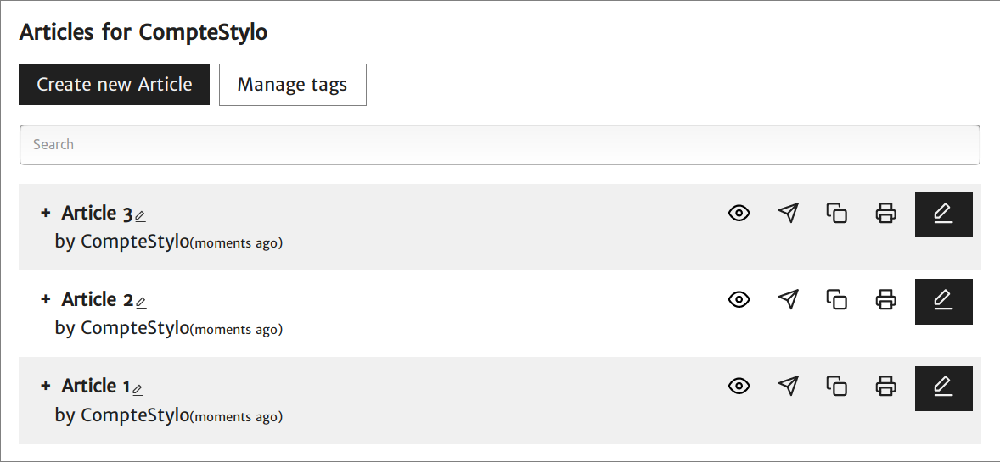

Chaque article se présente comme un bloc dans votre liste. Cet espace dédié à un article seulement vous permet d'effectuer plusieurs opérations immédiates :

|Bouton|Fonction|
|:-:|:--|
| 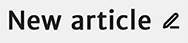 | pour renommer l'article |
|  | pour prévisualiser l'article |
|  | pour partager l'article et son historique de versions avec un autre usager de Stylo qui s'intitulera ainsi : "[Copy]Titre de l'article" |
| 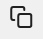 | pour dupliquer uniquement la dernière version de l'article |
|  | pour dupliquer uniquement la dernière version de l'article |
|  | pour ouvrir l'article en édition |
|  | pour supprimer l'article |

Vous pouvez également développer le bloc de l'article en cliquant sur le chevron situé à gauche du titre de votre article. Vous avez alors accès à :

|Bouton|Fonction|
|:-:|:--|
| 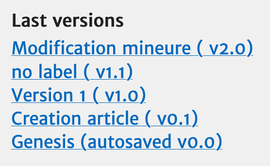 | pour consulter l'historique des versions enregistrées |
| 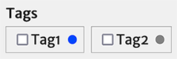 | pour choisir les tags de l'article |

## Renommer un article

Vous pouvez renommer votre article en cliquant sur l'icône stylo située à droite du titre actuel de votre article :

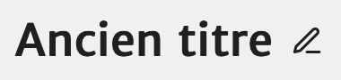

Après avoir modifié le titre de l'article selon votre convenance, n'oubliez-pas d'enregistrer :

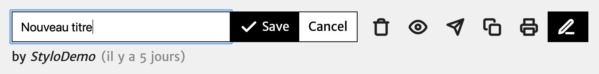

## Prévisualiser un article

Il vous est possible de prévisualiser votre article en cliquant sur l'icône suivante :

La prévisualisation vous permettra la lecture du contenu de l'article édité et l'[annotation](http://stylo-doc.ecrituresnumeriques.ca/fr_FR/#!pages/preview.md).

## Partager un article

Vous pouvez également partager votre article avec d'autres utilisateurs Stylo en cliquant sur l'icône suivante :

Pour partager, vous devez renseigner l'adresse courriel de l'utilisateur Stylo : il s'agit de l'adresse courriel avec laquelle l'utilisateur a créé son compte Stylo. Une fois l'adresse renseignée, il vous faut l'ajouter en cliquant sur le bouton "Add".

La fonction [Grant Access] permet à plusieurs utilisateurs Stylo de travailler sur le même article. Ces utilisateurs ont alors accès à tout l'historique. Les versions de l'article se synchronisent pour tous les utilisateurs au fur et à mesure des modifications effectuées sur le document.

Cette fonctionnalité vous permet également d'envoyer une copie de l'article :

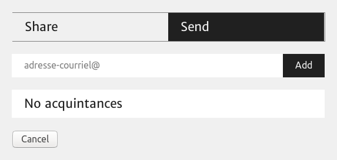

L'option [Send a Copy] n'est pas un partage d'article : seule la dernière version de l'article sera visible par l'utilisateur et les modifications ne seront pas visibles par les deux utilisateurs. Dans le processus [Send a Copy], deux versions de l'article sont créées et les utilisateurs travaillent chacun sur une version qui n'est pas visible par l'autre.

## Dupliquer un article

Vous pouvez dupliquer votre article en cliquant sur l'icône suivante :

Un doublon de l'article sera alors généré et apparaîtra en haut de la liste de vos articles Stylo. Cet article sera intitulé automatiquement comme suit : "[Copy]Titre de l'article". Ce doublon est créé à partir de la version actuelle (celle en cours d'édition) de l'article et ne comporte alors pas d'historique de versions.

## Exporter un article

Pour exporter un article, il faut cliquer sur le bouton "Export" depuis la page "Articles" ou depuis la page d'édition de l'article :

Le menu d'export permet de choisir le format d'export. Il contient également l'option d'intégrer ou non une table des matières.

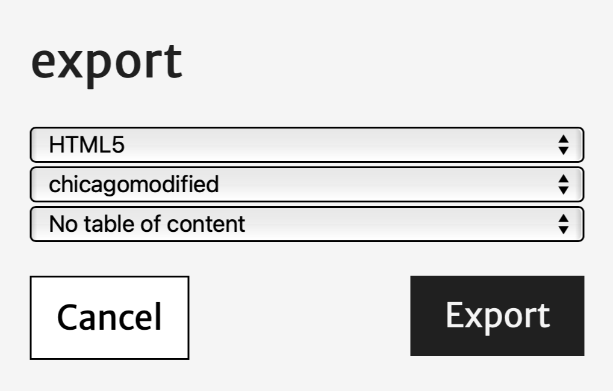

Les formats supportés sont les suivants :

- Fichiers originaux (markdown, yaml et bibtex)
- HTML5
- LaTex
- PDF
- ODT (Open Office)
- DOCX (Word)
- ICML (Impress)
- XML-TEI
- XML-Erudit
- XML-TEI Métopes

Il est possible de choisir parmi plusieurs styles bibliographiques : certains intègrent la référence dans le texte (par exemple Chicago, qui insère la référence dans le corps du texte entre parenthèses), d'autres ajoutent une note avec la référence.

Le module d'export se charge de mettre en forme les références, d'ajouter ou d'enlever les espaces, d'insérer des "Ibid." en accord avec le style, etc.

Les exports sont produits grâce à l'outil de conversion [pandoc](https://pandoc.org/) sur la base de templates disponibles [ici](https://framagit.org/stylo-editeur/templates-stylo).

L'export permet aussi de télécharger les fichiers source de Stylo (.md, .bib, .yaml) et les médias insérés dans l'article s'il y en a.

### Personaliser son export

À partir des fichiers source, il est possible de produire des exports personnalisés (mise en page, graphismes, métadonnées) en s'appuyant sur les fonctionnalités de l'outil de conversion [pandoc](https://pandoc.org/).

Pour plus d'informations sur l'emploi des templates, voir ce [tutoriel](https://gitlab.huma-num.fr/ecrinum/manuels/tutoriel-markdown-pandoc).

## Développer les autres fonctionnalités de l'article

Pour développer d'autres fonctions de l'article, il faut cliquer sur le chevron situé à gauche du titre de votre article :

### Accéder aux versions de l'article

Vous avez alors accès aux versions majeures et mineures de l'article : un clic sur le nom d'une version vous conduit à la page en mode "Édition" de la version en question.

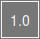

**Attention** : la page de la version à laquelle vous avez accès, bien qu'elle soit dans le mode "Édition", ne vous permet pas d'effectuer des modifications sur le contenu de l'article. Il s'agit d'une page en mode lecture uniquement à partir de laquelle vous pouvez effectuer des [exports]() et des [comparaisons]().

### Tager un article

Vous pouvez également associer des tags à votre article parmi la liste des tags existants, simplement en cochant le tag que vous souhaitez ajouter.

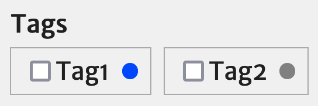

**Attention** : pour créer des tags, il faut vous reporter à l'outil [Manage tags].

### Supprimer un article

Pour supprimer un article de la liste de vos articles, il vous faut cliquer sur l'icône suivante :

Un onglet rouge apparaîtra automatiquement vous informant du processus de suppression :

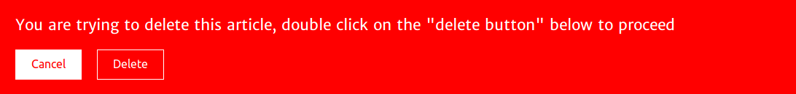

Pour supprimer définitivement votre article, il vous faut double-cliquer sur "Delete".
