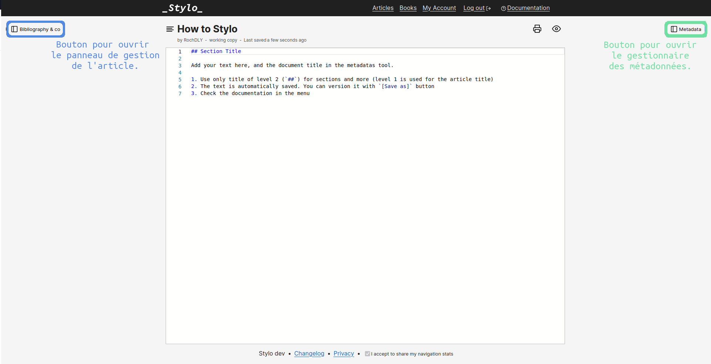
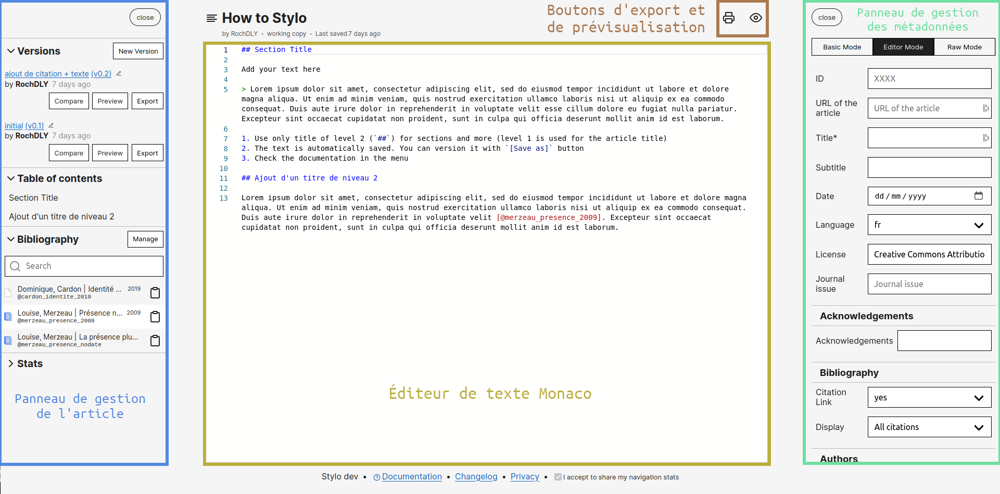
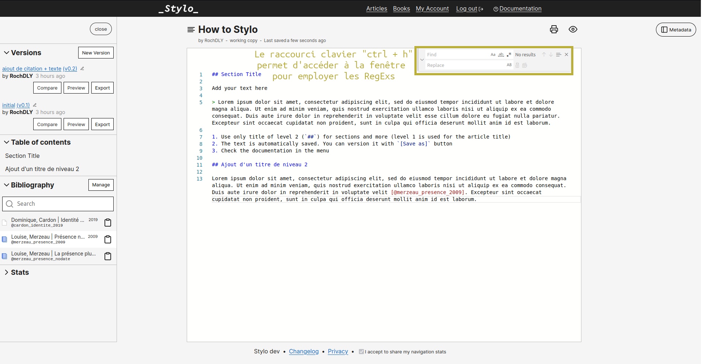
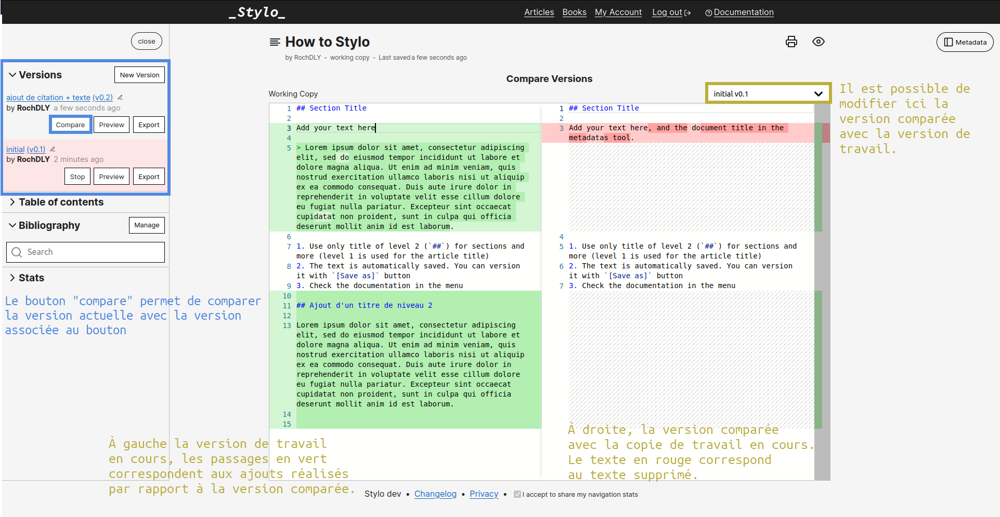

# Stylo v2.0 : une nouvelle version, de nouvelles fonctionnalités

**Stylo fait peau neuve !**

Chères utilisatrices, chers utilisateurs de Stylo,

Pour ce début d'année, nous vous avons concocté une nouvelle mouture de Stylo comportant de nouvelles fonctionnalités pour continuer à se rapprocher de vos pratiques d'écriture/édition savante et de vos besoins en la matière !

Quoi de neuf dans Stylo 2.0 ? Ci-dessous un tour d'horizon des modifications apportées :

- des améliorations de l'interface graphique ;
- l'implémentation d'un nouvel éditeur de texte (avec des fonctions avancées de chercher-remplacer) ;
- l'autocomplétion des références bibliographiques directement dans le texte ;
- de nouvelles entrées pour les métadonnées (notamment pour le mode éditeur) ;
- un nouveau module d'export ;
- un service dissocié pour l'utilisation du logiciel Pandoc (en mode SaaS) ;
- une stabilisation de la fonctionnalité de partage des articles et des comptes ;
- une API GraphQL (bientôt documentée).

Voici quelques détails sur ces modifications :

## Interface graphique

Quelques changements graphiques ont été apportés pour rafraîchir un peu l'interface :

- les colonnes gestionnaires (édition et métadonnées) ont été légèrement retouchées ;
- les boutons de *preview* et d'export ont été déplacés : ils ne sont plus à l'intérieur du volet de gestion à gauche mais dans la partie centrale de l'écran, au-dessus de l'éditeur de texte.






## Un nouvel éditeur de texte

L'éditeur de texte, pièce centrale de Stylo, a été complètement refondu ! Nous avons intégré un nouvel éditeur : [Monaco](https://microsoft.github.io/monaco-editor/index.html). De nouvelles fonctionnalités sont maintenant disponibles : 

- des fonctions de recherche et de remplacement disponible, via les raccourcis `CTRL/Cmd+F` et `CTRL/Cmd+H` ;
- l'utilisation d'expressions régulières ;
- un comportement plus précis de la fonctionnalité de comparaison entre différentes versions d'un même document (fonctionnement ligne à ligne).





## Autocomplétion

Grâce au nouvel éditeur de texte, nous pouvons automatiser certains aspects de l'écriture en suivant le principe d'autocomplétion. Nous avons ajouté la possibilité d'autocompléter les clés BibTeX pour ajouter vos références bibliographiques plus simplement et sans erreur ! Il vous suffit de commencer à écrire `\[@` ou simplement `@` pour que l'éditeur de texte vous propose toutes vos références associés à l'article. Si vous souhaitez affiner l'autocomplétion il suffira d'ajouter la première lettre du nom de l'auteur pour réduire les propositions faites.


## Module d'export

Fort de notre expérience en matière de chaîne basée sur le concept de *single source publishing* (possibilité de produire formats de sortie à partir d'une seule source), nous sommes repartis de zéro pour vous proposer un nouveau module d'export plus stable, plus beau et plus performant. Contrairement au module *legacy* (l'ancien export), le nouveau module d'export permet dorénavant un export au format XML-TEI Commons Publishing, schéma partagé par l'infrastructure [Métopes](http://www.metopes.fr/) et [OpenEdition](https://www.openedition.org/) !


## Service web Pandoc

Le cœur technologique du module d'export de Stylo repose sur le logiciel de conversion [Pandoc](https://pandoc.org/). Dans un souci d'être au plus proche des besoins des utilisateurs et utilisatrices, nous avons décidé de décentraliser Pandoc dans une interface web indépendante de Stylo. Ainsi Pandoc devient accessible via une interface graphique et offre la possibilité de customiser à souhait les documents que l'on souhaite transformer ! Ce service repose sur une API que nous utilisons pour notre module d'export Stylo.

## API GraphQL

L'API donne accès aux données de Stylo grâce au langage de requête GraphQL ! Depuis l'*endpoint* (https://stylo.huma-num.fr/graphql), il devient possible de connecter Stylo à tout un ensemble de fonctionnalités réalisées par vos soins, donc sur mesure ! Par exemple, l'API vous permet de récupérer vos articles et de les intégrer dans votre générateur de site statique préféré. Des démonstrations seront bientôt proposées.

Pour exécuter une requête POST, vous devez tout d'abord récupérer votre *APIkeys* dans les paramètres de votre compte Stylo. Ensuite, vous pouvez écrire votre requête dans votre environnement préféré (ex: GraphQL Playground) et commencer à jouer avec vos données Stylo ! Si vous utilisez GraphQL Playground, l'API s'auto-documente directement dans votre interface ! Vous accéderez à l'ensemble des requêtes et paramètres utilisables en seulement quelques clics.

Voici un exemple de requête pour récupérer tous vos articles : 

```
query tousMesArticles {
  user {
    _id
    email
    
    articles {
      _id
      title
    }
  }
}
``` 

## À découvrir bientôt

La documentation de Stylo est en cours de mise à jour pour préciser tous ces changements.

Nous prévoyons d'ores et déjà d'autres améliorations pour Stylo, comme le remplacement du partage de compte par une nouvelle fonctionnalité ou encore l'amélioration de la fonctionnalité _book_ !  
N'hésitez pas à nous suivre sur [Twitter](https://twitter.com/ENumeriques/) ou sur [le site de la CRCEN](https://ecrituresnumeriques.ca) pour obtenir les dernières informations sur Stylo.

À vos Stylo(s) !

L'équipe de la CRCEN
