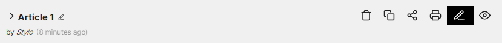
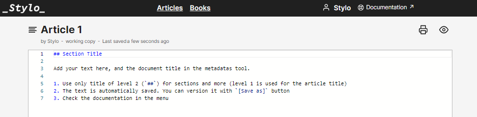
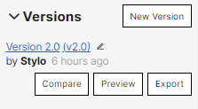

# Prévisualiser et annoter un article

## Prévisualisation
Il est possible de prévisualiser un article Stylo en HTML avec une mise en page par défaut.

Pour prévisualiser un article, il est possible :

- De cliquer sur le bouton "Preview" depuis la page "Mes articles", à droite de l'icône "Edit" :

- De cliquer sur le bouton "Preview" depuis la page d'édition de l'article, en haut à droite du corps de texte : 

La prévisualisation est disponible via un permalien qui reste le même pour toute la vie de l'article. Si l'article est modifié, le lien de prévisualisation montrera la dernière version de l'article.

Il est possible aussi de prévisualiser une version particulière de l'article. Pour ce faire, il faut cliquer sur le bouton "Preview" dans la page d'édition de l'article, dans la colonne de gauche, à l'intérieur du sous-menu "Versions".

Le lien de visualisation d'une version affiche toujours la version sauvegardée.

## Annotation

Dans la page de prévisualisation d'un article Stylo, en haut à droite du navigateur se trouve l'outil d'annotation [Hypothesis](https://web.hypothes.is/). Pour l'utiliser, il est nécessaire de créer un compte Hypothesis ([Sign up](https://web.hypothes.is/start/)).

Pour annoter, sélectionnez la partie du texte à commenter : une icône d'annotation apparaîtra. Veuillez sélectionner le mot en entier, le cas échéant, et pas seulement une lettre ou un signe typographique. Il vous est possible de le surligner (*Highlight*) ou d'annoter (*Annotate*). L'annotation peut être privée ("Post to Only me") ou publique ("Post to Public") et visible par d'autres utilisateurs d'Hypothesis ayant accès à l'URL preview de l'article.

Il y a deux possibilités d'annotation :

- Annoter une version de l'article : les annotations seront attachées à cette version uniquement et ne seront pas visibles dans la preview d'autres versions. 

Pour annoter une version, cliquez sur le numéro de la version que vous voulez annoter et ensuite cliquez sur "**preview**". Une prévisualisation de l'article en html s'ouvrira avec l'outil d'annotation Hypothes.is sur la droite.

- Annoter l'edit de l'article : les annotations seront visibles.

Pour annoter l'article, cliquez sur "**Edit**" et ensuite sur "**preview**". Les annotations concerneront l'article : elles seront visbles dans chaque version éditable. Cependant, puisque l'article est sujet à des changements, il peut arriver que les annotations perdent leurs ancrages (suite à la suppression des portions de textes auxquelles elles étaient liées) et se retrouvent déplacées ailleurs dans l'article ou orphelines. 

### Documentation supplémentaire 
Pour en savoir plus, voir cette [vidéo explicative](https://youtu.be/zdQRv9wndcE).

