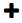
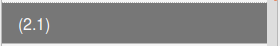
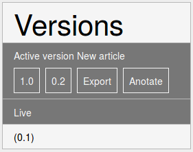
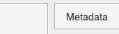

# Premiers pas

Un article dans Stylo est composé à partir de trois éléments distincts :

  - un corps de texte
  - des métadonnées
  - une bibliographie

## Liste des articles

La page d'accueil de votre compte Stylo liste vos articles ainsi que ceux qui ont été partagés avec vous.

Par défaut, un premier article “How to Stylo” est présent sur la plateforme, et détaille chaque étape de la rédaction d’un article. N’hésitez pas à vous y référer si vous souhaitez directement écrire votre article dans Stylo, ou si vous avez des questions sur des articles à traitement particulier (illustrations, etc.).

Pour chaque article, plusieurs actions sont possibles :

|bouton|fonction|
|:-:|:--|
|  | pour ouvrir l'article en édition|
|  | pour partager l'article et son historique de versions avec un autre usager de Stylo|
|  | pour envoyer uniquement la dernière version de l'article à un autre usager de Stylo|
|  | pour renommer l'article|
|  | pour supprimer l'article et tout son historique de versions|

Note: Le nom du document tel que visible sur Stylo ne correspond pas au titre de l'article qui sera généré.

Attention: Supprimer un article est irréversible. Si l'article est partagé avec un autre usager, après sa suppression, il restera accessible pour ce dernier.

 Le bouton **[+]** donne accès à d'autres possibilités d'édition du document : 

- les options de partage (**[Share]**, **[Fork]**, **[Send]**)
- la liste des précédentes versions enregistrées
- l'édition des **[Tags]**
- la suppression du document avec le bouton **[Delete]**

## Les options de partage

La fonction **[Share]** permet d'inviter des co-auteur·rice·s à travailler sur le même article. Ce personnes ont alors accès à tout l'historique. Les versions de l'article se synchronisent pour tous les utilisateur·rice·s au-fur-et à mesure des modifications effectuées sur le document.

La fonction **[Fork]** est utile pour créer, à partir de la dernière version, un nouvel article, sans l'historique des versions. Dans ce cas, le nouvel article est ajouté à la liste de vos articles.

La fonction **[Send]** réalise la même opération, mais le nouvel article est directement envoyé à un autre usager. Dans ce cas, le nouvel article n'est pas ajouté à la liste de vos articles. Cette fonction est utilisée par exemple pour soumettre un article à un éditeur·rice pour révision. Après révision, l'éditeur·rice pourra soit "partager" (**[Share]**) l'article révisé, donnant ainsi accès à l'auteur·e aux annotations des évaluateur·rice·s, soit "envoyer" (**[Send]**) l'article pour ne donner accès qu'à la version modifiée sans le suivi des annotations.

## Nouvel article

Cliquez sur le boutton “Create a new article” (vous devrez renseigner le titre de l’article dans la case prévue à cet effet, puis cliquer à nouveau sur le bouton “create”).

Pour créer un nouvel article, il suffit de cliquer sur le bouton, . Vous devez ensuite renseigner le nom du document dans le champs prévu à cet effet  et valider l'opération en cliquant une nouvelle fois sur le bouton . 

L’article apparait désormais dans votre liste d’articles. Cliquez sur  pour accéder à l’environnement d’édition et commencer à éditer votre article.

## Édition

L'environnement d'édition est composé de 5 modules :

- au centre : l'espace d'écriture consacré au corps de texte de l'article
- à droite : le bouton **[Metadata]** ouvre l'éditeur de métadonnées
- à gauche :
  - l'historique des versions du document pour naviguer et agir sur les différentes versions enregistrées
  - le sommaire (*Table of content*) de l'article liste les titres de niveau 2, 3 et suivants
  - la bibliographie (*Bibliography*) liste les références bibliographiques
  - les statistiques (*Stats*) offrent quelques données quantitatives sur l'article

## Écrire en Markdown

Le langage Markdown permet une syntaxe simple d'usage autant en lecture qu'écriture. Voici ici les principales règles d'écriture en Markdown : 

- Titre : les niveaux des titre (titre de niveau 1 pour le titre de l'article, de niveau 2 pour les titres de section, etc.) sont renseignés avec un ```#```, ainsi :
	- ```# Titre d'article```, ```## Introduction```, etc.

Attention: Le corps de texte de l'article ne supporte pas les titres de niveau 1, le titre de niveau 1 est uniquement réservé au champs *Title* dans les métadonnées.

- Italique : l'italique se balise dans le texte de deux manières : ```_mot_``` ou ```*mot*```
- Gras : le gras se balise dans le texte ainsi : ```**mot**```
- Citation longue : les citations longues dans le texte sont balisées ainsi : ```> citation longue```
- Note : une note dans le texte se balise selon qu'elle est avec ou sans appel de note : 
	- avec appel de note : 
```
Voici mon texte[^1]

[^1]:Une note de bas de page avec appel et renvoi
```

	- sans appel de note : 
```
Voici mon texte^[une note de bas de page inline.]
```

Pour approfondir vos connaissances en syntaxe Markdown, vous pouvez consulter la [page suivante](http://stylo-doc.ecrituresnumeriques.ca/fr_FR/#!pages/syntaxemarkdown.md).

## Versions

Une version du document correspond à une sauvegarde de votre travail. Une version contient toujours les trois éléments de l'article : métadonnées, bibliographie, corps de texte. Ainsi en chargeant une ancienne version, ce sont ces trois éléments qui sont mis à jour. 

Votre travail est automatiquement sauvegardé sur Stylo, vous pouvez - et cela est conseillé - cependant utiliser les fonctions de sauvegard pour enregistrer des versions mineures (**[Save Minor]**) ou majeures (**[Save Major]**) en nommant ces différentes versions. 



Ainsi, lorsque vous êtes parvenu·e·s à une version que vous jugez satisfaisante, vous pouvez titre votre version dans le champs *Label of the version* avant de l'enregistrer en tant que version mineure ou majeure. 

À tout moment, vous pouvez visualiser votre travail, la version actuelle que vous êtes en train d'éditer et les versions précédentes, en cliquant sur le bouton **[preview]**. Chaque version comporte ses plusieurs fonctionnalités : 

- Pour la version éditable (*Edition*) :
|bouton|fonction|
|:-:|:--| 
	- **[Save Minor]** et **[Save Major]** pour sauvegarder une version mineure ou majeure de votre travail
	- | | pour exporter et de télécharger le document dans différents format : html5, xml erudit, etc.
	- **[preview]** pour accéder à la prévisualisation de votre travail et l'annoter

- Pour une version antérieure :
|bouton|fonction|
|:-:|:--|
	- **[Compare]** pour comparer les différentes versions (une version antérieure et la version actuelle ou deux versions antérieures)
Note : Pour davantage d'informations sur la fonction **[Compare]**, vous pouvez consulter la [page suivante](http://stylo-doc.ecrituresnumeriques.ca/fr_FR/#!pages/interface.md)
	- | | pour exporter et de télécharger le document dans différents format : HTML5, xml erudit, etc.
	- **[preview]** pour accéder à la prévisualisation de votre travail et l'annoter
Note : Pour davantage d'informations sur la fonction **[preview]**, vous pouvez consulter la [page suivante](http://stylo-doc.ecrituresnumeriques.ca/fr_FR/#!pages/preview.md)

Pour visualiser une ancienne version, il vous suffit de cliquer sur son titre. Pour retourner à la version éditable, il vous faut cliquer sur le bouton **[Edit]**.

## - Export
Le module d'export offre plusieurs formats (HTML5, XML, PDF, etc.), permet de choisir un style bibliographique, et la présence ou non d'une table des matières. 

Pour davantage d'informations sur l'export Stylo, vous pouvez consulter la [page suivante](http://stylo-doc.ecrituresnumeriques.ca/fr_FR/#!pages/export.md)

## - Sommaire

Le sommaire affiche une liste des titres de niveau 1, 2 et suivants. Ces titres sont clicables pour accéder rapidement à la partie du texte correspondante. 

## - Bibliographie

La bibliographie liste les références bibliographiques que vous avez ajoutées. Les références bibliographiques peuvent être ajoutées une par une, ou groupées. Pour ajouter vos réfence, vous devez cliquer sur **[Manage Bibliography]** dans le volet de gauche : l'outil *Bibliographe* s'ouvre alors et vous propose plusieurs possibilités : 

- *Zotero* : il vous est possible de synchroniser votre bibliographie à partir d'un dossier Zotero (dossier qui doit être public) en entrant l'url du dossier. 
- *Citations* : il vous est possible de renseigner votre bibliographie manuellement sous format bibtex. 
- *Raw bibtex* : pour éditer le bibtex

Vous pouvez directement [structurer vos références en bibtex](http://www.andy-roberts.net/writing/latex/bibliographies), ou exporter vos références en bibtex grâce à votre outils de gestion de bibliographie :

- voir tutoriels : <a class="btn btn-info" href="http://sens-public.org/IMG/pdf/Utiliser_Zotero.pdf" role="button">Zotero</a> <a class="btn btn-info" href="https://libguides.usask.ca/c.php?g=218034&p=1446316" role="button">Mendeley</a>

Pour ajouter une référence à l'article, il suffit de cliquer sur la référence, puis de coller (Ctrl+V) la référence dans le texte à l'endroit souhaité. Ainsi, un clic revient à "copier" la clé de la référence dans le presse-papier. Il ne reste plus qu'à la coller dans le corps de texte. 

Note : Pour davantage d'informations sur la gestion de la bibliographie, vous pouvez consulter la [page suivante](http://stylo-doc.ecrituresnumeriques.ca/fr_FR/#!pages/bibliographie.md)


## - Métadonnées

Le bouton [Metadata] permet d'ouvrir le volet de métadonnées. Deux modes d'édition sont disponibles : 

1. **Mode auteur (simple)** - permet d'éditer les métadonnées fondamentales: Titre, sous-titre, résumés, auteurs et mots-clés.
2. **Mode éditeur (avancé)** - permet d'éditer l'ensemble des métadonnées relatives à une revue savante : identifiant d'un article, informations de dossier, information d'évaluation, catégories de la revue, mots-clés de la revue, etc.

## - Statistiques

Le menu "Statistiqes" donne des informations sur: 

- Le nombre de mots
- Le nombre de caractères
- Le nombre de citations

## Annotation

Il y a deux possibilités d'annotation:

1. Annoter une version
2. Annoter l'article

Pour annoter une version, cliquez sur le numéro de la version que vous voulez annoter et ensuite cliquez sur Anotate. Une prévisualisation de l'article en html s'ouvrira avec l'outil d'annotation hyothes.is sur la droite.
Si vous annotez une version, vos annotation ne seront pas visibles sur les autres versions.

Pour annoter l'article, cliquez sur Live et ensuite sur Anotate. Les annotations concerneront l'article. On pourra toujours les voir en regardant le "Anotate" du "Live". Cependant, puisque le live est sujet à des changements, les annotations pourront ne plus être ancrées aux bonnes parties du textes (qui pourraient avoir été supprimées ou déplacées).
